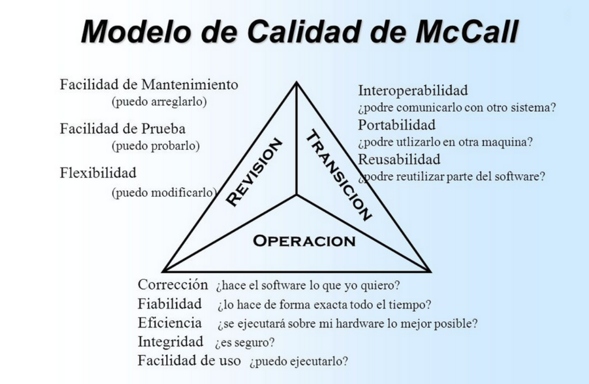

# Apunts_UF2_1

## Proves
**_Objectiu:_**

Provar si el software no fa el que ha de fer. I provar si el software fa el que no ha de fer.

Existeixen els **frameworks**, que són  un conjunt de les millors pràctiques de programació i suposicions, que utilitza eines comuns i biblioteques, que serveixen per a unificar el procès de desenvolupament entre desarolladors.

### Tipus de proves:

**Proves dinàmiques:**  Requereixen de l’execució del programa. Permet saber com es comportara el programa que hem fet.

**Proves estàtiques:** No requereixen d’execució del codi, sino que examina el codi font.

**Proves de caixa negre:** Estudien el programen desde fora, és a dir, són probes de funcionalitat.

    Estrategies de prova de caixa negre:

    S'estudia el sistema desde fora.
    Es trabaja sobre l' interfície.
    No tenen en conte els detalls interns del funcionament.
    és proporcionen entrades i s'estudien les sortides.

    Tècniques principals:
    Particions d'equivalència.
    Valors límits.

**Proves de caixa blanca:** Examina el codi font i la seva execució, és a dir, són probes estrucurals.

      Estrategies de prova de caixa blanca:

      S'examina el codi font i la seva execució.
      és comproven els fluxes d'execució dins de cada unitat (funció, clase,modúl...).
      Poden comprovar-se els fluxes entre unitats durant l'integració, inclós entre subsistemes, durant les proves de sistema.

      Principals tècniques:
      Cobertura de codi.
      Prova de bucles.

**Proves funcionals:** Evaluen el que es cumpleixin tots els requisits.

**_Exemple de proves funcionals:_**

 - Proves unitaries (o d'unitat)
 - Proves de regresió
 - Proves d'integració
 - Proves de fum (smoke test)
 - Proves del sistema
 - Proves alfa i beta
 - Proves d'acceptació (validació per part del client)

**Proves no funcionals:** Evaluen aspectes com el rendiment, la seguretat.

 **_Exemple de proves no funcionals:_**

- Proves d'usabilitat
- Proves de rendiment
- Proves de stress
- Proves de seguretat
- Proves de compatibilidad
- Proves de portabilitat

### Mecànismes de proves

**Manual:** Mitjançant proves realitzades per personal de l'empresa o extern.

**Automàtic:** Mitjançant software que executa codi font de forma automatizada i compara els resultats obtinguts i els resultats esperats.

## Integració

### Formes d'integració

  - Integració Big Bang
  - Integració Descendent
  - Integració Ascendent
  - Integració Continua (CI)

**_Ci:_** Integració continua.

**_CD_:** Entrega continua

  **Servidors d'integració continua:**

- Jenkis
- Bamboo
- TravisCI
- CircleCI

### Cobertures del codi.

- És un mesura que indica el percentatge de codi que ha sigut executat.
- És posible realitzar la cobertura tant desde el IDE com desde un servei web.

### Qualitat

## Control de qualitat
És per aconseguir una medició de la qualitat d'un producte, per això necesitem realitzar proves.

## Control del procès/ producte.

**QA:** És un conjunt d'activitats per a garantir la qualitat en els procesos mitjançant els quals es desenvolupen els productes.

**QC:** És un conjunt d'activitats per a garantir la qualitat dels productes. Les activitatss es centren en identificar en els productes reals.

## Factors de qualitat

El model de qualitat de McCall defineix 11 factors de qualitat, aquests s'agrupen en 3 ambits:

- Operació del producte
      Correció
      Fiabilitat
      Eficiència
      Seguretat
      Facilitat d'ús
- Revisió del producte
      Mantenibilitat
      Flexibilitat
      Facilitat de proves

- Transició del producte
      Portabilitat
      Reusabailitat
      Interopreativitat

Exemple:

